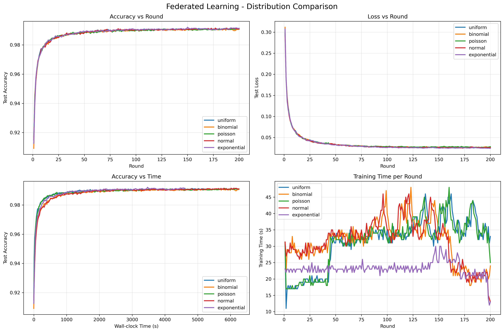

# 联邦学习客户端选择分布对比实验 🚀

## 📊 项目概述

本项目复现了论文《Communication-Efficient Learning of Deep Networks from Decentralized Data》中的核心算法FederatedAveraging (FedAvg)，并专注于对比**5种不同客户端选择概率分布**对联邦学习性能的影响。

### 🎯 实验范围
- ✅ **数据集**: MNIST (IID 分布)
- ✅ **模型**: CNN (1,708,106参数)
- ✅ **算法**: FederatedAveraging (FedAvg)
- ✅ **核心对比**: 5种客户端选择概率分布
- 🔵 **Uniform** (均匀分布) - 基准
- 🟠 **Binomial** (二项分布) - Beta分布概率选择
- 🟢 **Poisson** (泊松分布) - 泊松随机选择
- 🔴 **Normal** (正态分布) - 空间权重选择  
- 🟣 **Exponential** (指数分布) - 指数衰减选择

### 🔬 实验目标
1. 对比不同客户端选择分布的**收敛性能**
2. 分析各分布的**公平性**（选择均匀程度）
3. 研究**训练效率**和时间成本
4. 提供**可视化对比**和详细分析报告

## 🚀 快速开始

### 📦 环境准备

**1. 克隆项目**
```bash
git clone <repository_url>
cd FedAvg
```

**2. 安装依赖**
```bash
pip install -r requirements.txt
```

**3. 验证环境**
```bash
python test_implementation.py
```

### 🎮 运行实验

#### 方法一：单个分布实验（推荐用于学习）

```bash
# 运行均匀分布实验
python run_uniform.py

# 运行二项分布实验  
python run_binomial.py

# 运行泊松分布实验
python run_poisson.py

# 运行正态分布实验
python run_normal.py

# 运行指数分布实验
python run_exponential.py
```

#### 方法二：批量运行所有实验（推荐用于完整对比）

```bash
# 一次性运行所有5个分布实验
python run_all_distributions.py
```

#### 方法三：可视化结果

```bash
# 自动检测并可视化所有已完成的实验
python visualize.py
```

### 📊 项目结构

```
FedAvg/
├── src/                     # 核心源代码
│   ├── client_selection/   # 5种客户端选择策略
│   ├── data/               # MNIST数据处理
│   ├── models/             # CNN模型定义  
│   └── algorithms/         # FedAvg算法实现
├── experiments/            # 实验脚本
│   └── run_single_distribution.py
├── configs/                # 配置文件
│   └── base_config.yaml
├── results/                # 实验结果
│   ├── logs/              # 详细训练日志
│   ├── models/            # 保存的模型
│   └── figures/           # 对比图表
├── run_*.py               # 单分布运行脚本
├── run_all_distributions.py  # 批量运行脚本
├── visualize.py           # TIFL风格可视化
├── test_implementation.py # 环境测试
└── requirements.txt       # 依赖包列表
```

## 🔧 核心功能

### 📈 实验配置

**默认超参数**：
- 客户端总数：100
- 每轮选择客户端数：10 (C=0.1)  
- 本地训练轮数：5 (E=5)
- 批大小：10 (B=10)
- 学习率：0.01
- 总训练轮数：200
- 数据分布：IID

### 🎯 5种客户端选择分布

| 分布 | 描述 | 核心参数 |
|------|------|----------| 
| 🔵 **Uniform** | 均匀随机选择 | 无 |
| 🟠 **Binomial** | Beta分布概率选择 | α=2, β=5 |
| 🟢 **Poisson** | 泊松分布随机选择 | λ=5 |
| 🔴 **Normal** | 正态分布空间权重 | σ=1.0 |
| 🟣 **Exponential** | 指数衰减选择 | λ=1.0 |

### 🏗️ CNN模型架构

```
输入: 28×28×1 (MNIST)
├── Conv1: 5×5, 32通道, ReLU
├── MaxPool: 2×2
├── Conv2: 5×5, 64通道, ReLU  
├── MaxPool: 2×2
├── FC1: 1600神经元, ReLU
└── FC2: 10神经元 (输出)

总参数量: 1,708,106
```

## 📊 实验结果示例

基于已完成的uniform和poisson分布实验：

| 分布 | 最终准确率 | 训练时间 | 公平性比率* |
|------|-----------|----------|-------------|
| 🔵 Uniform | 99.13% | 41.1 min | 3.10 |
| 🟢 Poisson | 99.14% | 42.5 min | - |

*公平性比率 = 最大选择次数/最小选择次数（越接近1越公平）

## 🎨 可视化功能
运行 `python visualize.py` 后自动生成包含4个子图的对比图：

1. **Accuracy vs Round** - 准确率随轮次变化
2. **Loss vs Round** - 损失随轮次变化  
3. **Accuracy vs Time** - 准确率随时间变化
4. **Training Time per Round** - 每轮训练时间

### 特色功能

- ✅ **自动检测**：扫描所有已完成实验
- ✅ **实时更新**：每次新实验后重新可视化包含所有数据
- ✅ **颜色区分**：每个分布用不同颜色清晰标识
- ✅ **详细统计**：显示性能排名和收敛分析

## 📝 详细日志

每次实验都会生成详细的训练日志：

```
results/logs/uniform_20251021_035945.log
```

日志内容包括：
- 每轮的准确率和损失
- 选中的客户端ID
- 训练时间统计
- 实验配置信息
- 最终性能摘要

## 🛠️ 使用指南

### 📋 完整实验流程

**推荐顺序**：

1. **环境测试** 
```bash
python test_implementation.py
```

2. **运行单个实验** (学习阶段)
```bash
python run_uniform.py
python visualize.py  # 查看结果
```

3. **批量运行** (对比分析)
```bash
python run_all_distributions.py  # 自动运行所有实验并生成对比图
```

### 🔧 自定义配置

修改 `configs/base_config.yaml` 可以调整实验参数：

```yaml
federated:
  clients_per_round: 10    # 每轮选择的客户端数 (C)
  local_epochs: 5          # 本地训练轮数 (E)
  batch_size: 10           # 批大小 (B)

training:
  num_rounds: 200          # 总训练轮数
  learning_rate: 0.01      # 学习率 (η)
```

### 📂 结果展示



============================================================  
📊 UNIFORM 分布选择分析  
============================================================  
**总轮数: 200**  
**平均选择次数: 40.00**  
**标准差: 8.80**  
**最大选择次数: 62.0**  
**最小选择次数: 20.0**  
**公平性比率 (max/min): 3.10**  

选择次数分布:  
  被选20次: 1个客户端  
  被选24次: 4个客户端  
  被选26次: 2个客户端  
  被选28次: 2个客户端   
  被选30次: 5个客户端  
  被选32次: 8个客户端  
  被选34次: 9个客户端  
  被选36次: 6个客户端  
  被选38次: 9个客户端  
  被选40次: 9个客户端  

选择最多的5个客户端:  
  客户端 27: 被选 62 次  
  客户端 90: 被选 60 次  
  客户端 15: 被选 60 次  
  客户端 62: 被选 56 次  
  客户端 85: 被选 56 次  

选择最少的5个客户端:  
  客户端 31: 被选 20 次  
  客户端 36: 被选 24 次  
  客户端 3: 被选 24 次  
  客户端 19: 被选 24 次  
  客户端 26: 被选 24 次


============================================================  
📊 BINOMIAL 分布选择分析  
============================================================  
总轮数: 200  
平均选择次数: 40.00  
标准差: 20.00  
最大选择次数: 86.0  
最小选择次数: 0.0  
公平性比率 (max/min): 86.00  

选择次数分布:
  被选0次: 1个客户端  
  被选6次: 2个客户端  
  被选8次: 1个客户端  
  被选10次: 3个客户端  
  被选12次: 3个客户端  
  被选14次: 2个客户端  
  被选16次: 1个客户端  
  被选18次: 4个客户端  
  被选20次: 3个客户端  
  被选22次: 2个客户端  

⚠️  警告: 有 1 个客户端从未被选中!  
未选中的客户端ID: [26]  

选择最多的5个客户端:  
  客户端 45: 被选 86 次  
  客户端 51: 被选 86 次  
  客户端 7: 被选 80 次  
  客户端 15: 被选 80 次  
  客户端 95: 被选 76 次  
  
选择最少的5个客户端:  
  客户端 26: 被选 0 次  
  客户端 43: 被选 6 次  
  客户端 87: 被选 6 次  
  客户端 53: 被选 8 次  
  客户端 57: 被选 10 次

============================================================  
📊 POISSON 分布选择分析  
============================================================    
总轮数: 200  
平均选择次数: 40.00  
标准差: 20.17  
最大选择次数: 98.0  
最小选择次数: 0.0  
公平性比率 (max/min): 98.00  

选择次数分布:  
  被选0次: 1个客户端  
  被选4次: 1个客户端  
  被选8次: 2个客户端  
  被选10次: 4个客户端  
  被选12次: 2个客户端  
  被选14次: 2个客户端  
  被选16次: 2个客户端  
  被选20次: 3个客户端  
  被选22次: 3个客户端  
  被选24次: 4个客户端  
  
⚠️  警告: 有 1 个客户端从未被选中!  
未选中的客户端ID: [57]

选择最多的5个客户端:  
  客户端 91: 被选 98 次  
  客户端 90: 被选 90 次  
  客户端 75: 被选 80 次  
  客户端 46: 被选 80 次  
  客户端 34: 被选 74 次  

选择最少的5个客户端:
  客户端 57: 被选 0 次  
  客户端 74: 被选 4 次  
  客户端 70: 被选 8 次  
  客户端 58: 被选 8 次  
  客户端 81: 被选 10 次


============================================================  
📊 NORMAL 分布选择分析  
============================================================  
总轮数: 200  
平均选择次数: 40.00  
标准差: 13.08  
最大选择次数: 66.0  
最小选择次数: 0.0  
公平性比率 (max/min): 66.00  
  
选择次数分布:  
  被选0次: 1个客户端  
  被选14次: 1个客户端  
  被选16次: 1个客户端  
  被选18次: 2个客户端  
  被选20次: 2个客户端   
  被选22次: 3个客户端  
  被选24次: 2个客户端  
  被选26次: 5个客户端  
  被选28次: 7个客户端   
  被选30次: 4个客户端  

⚠️  警告: 有 1 个客户端从未被选中!  
未选中的客户端ID: [85]

选择最多的5个客户端:  
  客户端 67: 被选 66 次  
  客户端 24: 被选 64 次  
  客户端 71: 被选 64 次  
  客户端 61: 被选 64 次  
  客户端 52: 被选 64 次  

选择最少的5个客户端:  
  客户端 85: 被选 0 次  
  客户端 25: 被选 14 次  
  客户端 47: 被选 16 次  
  客户端 76: 被选 18 次  
  客户端 92: 被选 18 次  


============================================================  
📊 EXPONENTIAL 分布选择分析  
============================================================  
总轮数: 200  
平均选择次数: 40.00  
标准差: 13.51  
最大选择次数: 80.0  
最小选择次数: 14.0  
公平性比率 (max/min): 5.71  

选择次数分布:  
  被选14次: 1个客户端  
  被选16次: 1个客户端  
  被选18次: 2个客户端  
  被选20次: 1个客户端  
  被选22次: 1个客户端  
  被选24次: 2个客户端  
  被选26次: 6个客户端  
  被选28次: 6个客户端  
  被选30次: 12个客户端  
  被选32次: 4个客户端  
  
选择最多的5个客户端:  
  客户端 10: 被选 80 次  
  客户端 8: 被选 76 次  
  客户端 23: 被选 66 次  
  客户端 5: 被选 66 次  
  客户端 0: 被选 62 次  

选择最少的5个客户端:  
  客户端 91: 被选 14 次  
  客户端 93: 被选 16 次  
  客户端 98: 被选 18 次  
  客户端 89: 被选 18 次  
  客户端 86: 被选 20 次  


### 📂 图片展示


### 详情分析
最佳选择: Uniform分布在联邦学习中表现最优，选择最公平  
最差选择: Poisson分布最不公平，容易导致某些客户端从不参与训练
不公平的客户端选择会导致：  
1、模型偏向某些客户端的数据  
2、部分客户端数据未被充分利用  
3、整体模型性能下降

### 📂 结果文件说明
实验完成后，在 `results/` 目录可以找到：

- **📊 `*_results.pt`** - 完整实验数据（准确率、损失、配置等）
- **🤖 `models/*.pt`** - 训练好的模型权重
- **📝 `logs/*.log`** - 详细训练日志（UTF-8编码，支持中文）
- **📈 `figures/*.png`** - TIFL风格对比图表

## 📚 论文与引用

### 原论文信息
- **标题**: Communication-Efficient Learning of Deep Networks from Decentralized Data
- **作者**: H. Brendan McMahan, Eider Moore, Daniel Ramage, Seth Hampson, Blaise Agüera y Arcas
- **发表**: AISTATS 2017


## 🤝 技术支持

### 常见问题

**Q: 实验运行速度慢？**
A: CNN训练需要一定时间。200轮大约需要40分钟（CPU）。可以在配置文件中减少 `num_rounds`。

**Q: 想要修改分布参数？**
A: 编辑各个 `run_*.py` 文件中的配置，或修改 `experiments/run_single_distribution.py` 中的 `get_distribution_config()` 函数。

**Q: 可视化图表显示问题？**
A: 确保安装了 `matplotlib` 和 `seaborn`。如果字体有问题，可能是中文字体支持问题。

### 开发扩展

- 📈 **添加新的客户端选择分布**: 继承 `ClientSelector` 基类
- 🗂️ **支持其他数据集**: 修改 `src/data/` 模块
- 🏗️ **使用其他模型**: 修改 `src/models/` 模块
- 🔬 **Non-IID实验**: 当前专注于IID，可扩展Non-IID划分

## 📄 许可证

MIT License - 详见项目根目录 LICENSE 文件

---

**⭐ 如果这个项目对您有帮助，请给个Star！**

**🚀 Happy Federated Learning!**